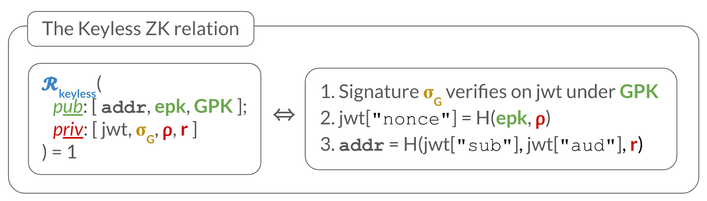
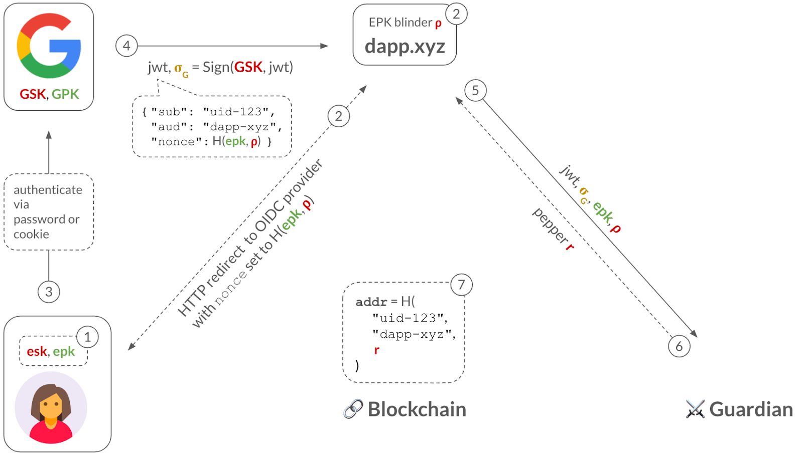
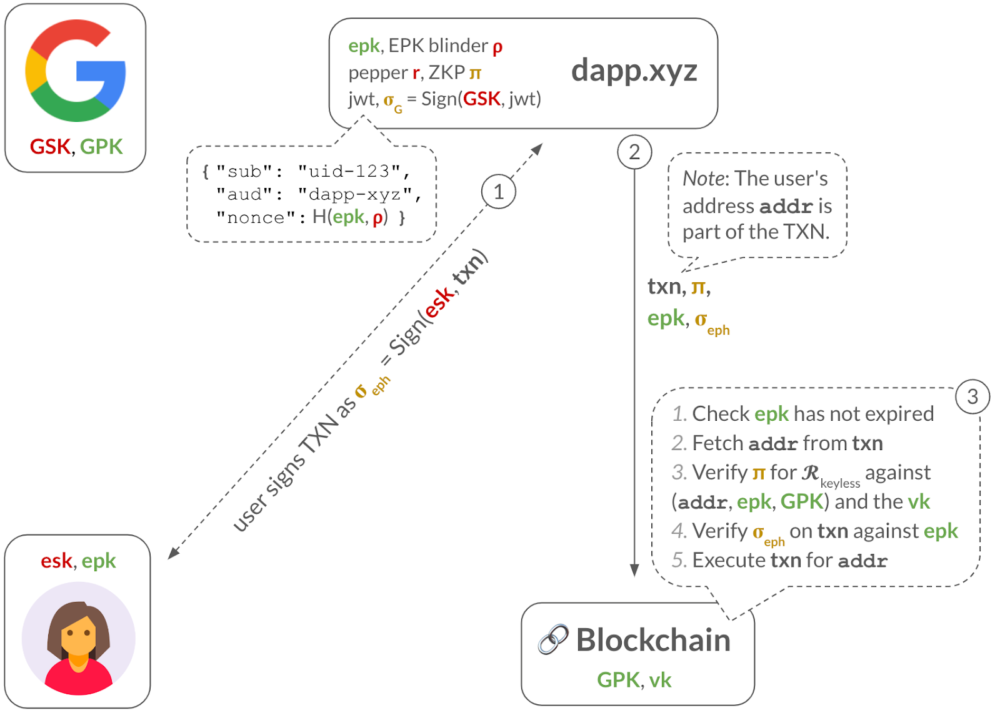

Aptos Keyless enables a dApp to **derive** and **access** a blockchain account for a user if that user successfully signs in to dApp via an OIDC provider (e.g., Google). Importantly, this blockchain account is **scoped to the dApp**. This means other dApps, who can similarly sign-in the same user, via the same OIDC provider, are not able to access this account and instead get their own account.

_But how does this work?_

At a very high level, a successful sign-in into the dApp via the OIDC provider will result in the dApp receiving a **JSON Web Token (JWT)** signed by the OIDC provider. The JWT will contain, among other things, three important pieces of information:

1. The user’s identity (contained in the JWT’s “sub” field)
2. The dApp’s identity (contained in the JWT’s “aud” field)
3. Application-specific data; specifically, an ephemeral public key (EPK) (contained in the JWT’s “nonce” field), whose associated ephemeral secret key (ESK) only the user knows.

Now, assume that the user’s blockchain account address is (more or less) a hash of the user’s identity in “sub” and the dApp’s identity in “aud” from above.

Then, the key observation is that the signed JWT effectively acts as a digital certificate, temporarily binding the blockchain address to the EPK, and allowing the EPK to sign TXNs for it. In other words, it securely delegates TXN signing rights for this blockchain account to the EPK. (Note: The EPK contains an expiration date and is thus short-lived.)

Importantly, if the user loses their ESK, the user can obtain a new signed JWT over a new EPK via the application by simply signing in again via the OIDC provider. (Or, in some cases, by requesting a new signed JWT using an OAuth refresh token.)

With this system, the challenge is maintaining privacy, since revealing the JWT on-chain would leak the user’s identity. Furthermore, revealing the EPK to the OIDC provider would allow it to track the user’s TXN on-chain.

We explain below how Keyless accounts work and how they address these challenges.
Flow: Deriving a keyless account for a user in a dApp
First, let us look at how a dApp can sign-in a user via (say) Google, derive that user’s keyless blockchain address and, for example, send that user an asset.

Step 1: The user generates an ephemeral key pair: an EPK with an expiration date, and its associated ESK. The dApp keeps the EPK and safely stores the ESK on the user-side (e.g., in the browser’s local storage, or in a trusted enclave if the ESK is a WebAuthn passkey).

Step 2: The dApp commits to the EPK using a blinding factor ⍴. When the user clicks on the “Sign in with Google” button, the dApp redirects the user to Google’s sign in page and, importantly, sets the nonce parameter in the URL to the EPK commitment. This hides the EPK from Google, maintaining privacy of the user’s TXN activity.

Step 3: Typically, the user has an HTTP cookie from having previously-signed-in to their Google account, so Google merely checks this cookie. If the user has multiple Google accounts, Google asks the user to select which one they want to sign-in into dApp.xyz. (The less common path is for the user to have to type in their Google username and password.)

Step 4: Once the user successfully signed in (via HTTP cookie or password), then Google will send the dApp a signed JWT, which includes the user's sub identifier (e.g., "uid-123"), the application’s aud identifier (e.g., "dApp-xyz") and the nonce with the EPK commitment. (This assumes that the dApp.xyz application has previously registered with Google and received this "dApp-xyz" identifier.)

Step 5: The dApp now has almost everything it needs to derive a keyless account for the user: the user’s identifier (sub) and the dApp’s identifier (aud). But, to preserve the privacy of the user, the dApp will use a third piece of information: a blinding factor r called a pepper. The dApp will contact a so-called guardian who will deterministically compute a random r for the given (sub, aud). Importantly, the guardian will only reveal r to the dApp upon seeing a validly-signed JWT for the queried (sub, aud).

Step 6: The dApp derives the address of the account as addr = H("uid-123", "dApp-xyz", r), where H is a cryptographic hash function.

Note that the pepper r is used to hide the user and app identity inside the address since, as we described above, only an authorized user with a valid JWT will be able to obtain this pepper.

Also, note that the address is independent of the EPK. This is why the ESK need not be long-lived and can be lost.

Finally, the dApp can, for example, send an NFT to the user at their address addr.

But how can the dApp authorize TXN from this account at addr? We discuss that next.
Flow: Obtaining a zero-knowledge proof before transacting
In the previous flow, we showed how a dApp can sign in a Google user and derive their privacy-preserving keyless address, with the help of a guardian.

Next, we show how this dApp can obtain a zero-knowledge proof (ZKP), which will allow it to authorize transactions from this address for the user. Importantly, the transaction will hide the user’s identifying information (e.g., the "sub" field).

Step 1: The dApp sends all the necessary public information (i.e., epk, GPK) and private information (i.e., JWT, signature σG from Google, EPK blinding factor ⍴, and pepper r) to the prover service.

Step 2: The prover derives the user’s address addr and computes a zero-knowledge proof (ZKP) π for the keyless relation 𝓡keyless (described below). It then sends π to the dApp.

The ZKP will be used to convince the validators that the user is in possession of (1) a JWT signed by Google, (2) which commits to the epk in its "nonce" field, and (3) contains the same information as in the address, without leaking anything about the JWT, its signature, ⍴, or r.

More formally, the ZKP π convinces a verifier, who has public inputs (addr, epk, GPK), that the prover knows secret inputs (jwt, σG, ⍴, r) such that the relation 𝓡keyless depicted below holds:

Recall from before that the signed JWT acts as a digital certificate, temporarily binding the blockchain address addr to the EPK, and allowing the epk to sign TXNs for it. However, the JWT would leak the user’s identity, so The ZKP serves to hide the JWT (and other private information) while arguing that the proper checks hold.

Next, we show how the dApp can now authorize TXNs from addr.
Flow: Sending a TXN from a keyless account
The previous flow explained how a dApp can obtain a ZKP from the prover service. Next, we describe how the dApp leverages this ZKP to transact for the account.

Step 1: The dApp obtains an ephemeral signature σeph over the TXN from the user. This could be done behind the user’s back, by the dApp itself who might manage the ESK. Or, it could be an actual signing request sent to the user, such as when the ESK is a WebAuthn passkey, which is stored on the user’s trusted hardware.

Step 2: The dApp sends the TXN, the ZKP π, the ephemeral public key epk, the ephemeral signature σeph to the blockchain validators.

Step 3: To check the TXN is validly-signed, the validators perform several steps: (1) check that epk has not expired, (2) fetch the user’s address addr from the TXN, (3) verify the ZKP against addr, epk, and Google’s GPK, and (4) verify the ephemeral signature σeph on the TXN against the epk. If all these checks pass, they can safely execute the TXN.
