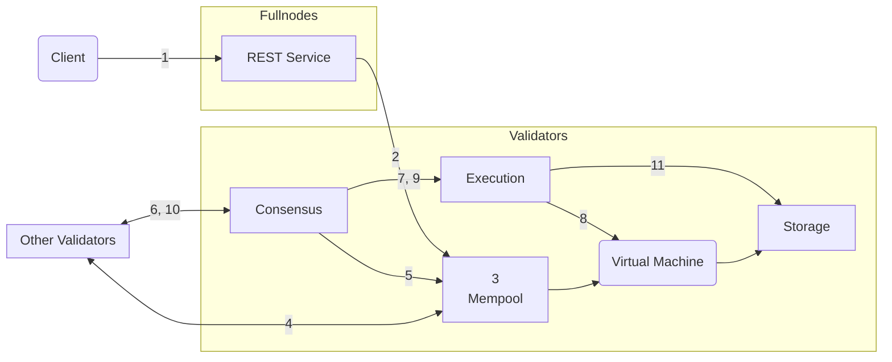
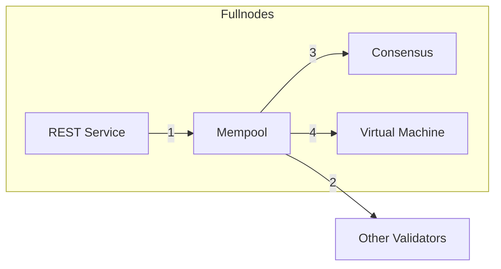
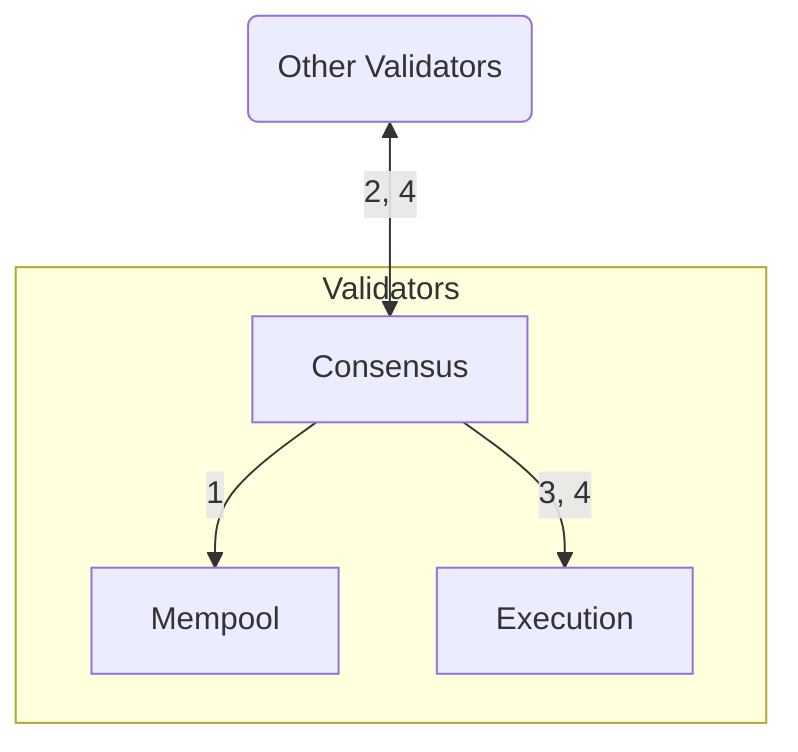
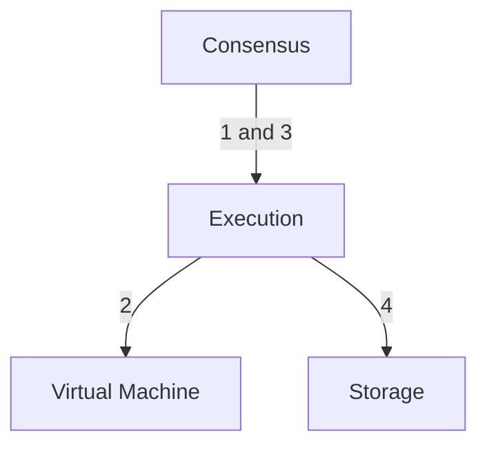
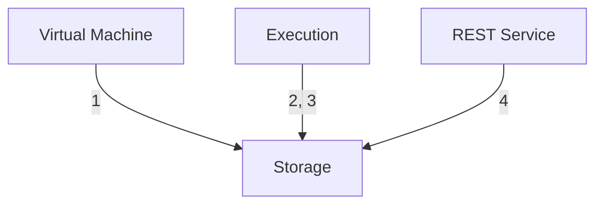

import { Callout } from 'nextra/components';

# Aptosブロックチェーンの詳細

Aptosトランザクションのライフサイクルをより深く理解するため（運用の観点から）、トランザクションがAptosフルノードに送信されてからAptosブロックチェーンにコミットされるまでの旅を追跡します。その後、Aptosノードの論理コンポーネントに焦点を当て、トランザクションがこれらのコンポーネントとどのように相互作用するかを見ていきます。

## トランザクションのライフサイクル

- AliceとBobはそれぞれAptosブロックチェーン上に[アカウント](../glossary.mdx#account)を持つ2人のユーザーです。
- Aliceのアカウントには110 Aptosコインがあります。
- AliceはBobに10 Aptosコインを送金しています。
- Aliceのアカウントの現在の[シーケンス番号](../glossary.mdx#sequence-number)は5です（これはAliceのアカウントからすでに5つのトランザクションが送信されたことを示します）。
- ネットワーク上には合計100のバリデータノード &mdash; V1からV100が存在します。
- AptosクライアントはAliceのトランザクションをAptosフルノード上のRESTサービスに送信します。フルノードはこのトランザクションをバリデータフルノードに転送し、さらにバリデータV1に転送します。
- バリデータV1は現在のラウンドのプロポーザー/リーダーです。

### トランザクションの旅

このセクションでは、トランザクションT5のライフサイクルについて、クライアントが送信してからAptosブロックチェーンにコミットされるまでを説明します。

関連するステップについては、バリデータノードのコンポーネント間の相互作用へのリンクを含めています。トランザクションのライフサイクルのすべてのステップに慣れたら、各ステップに対応するコンポーネント間の相互作用に関する情報を参照することをお勧めします。

<Callout type="info">
この記事のすべての図において、矢印は相互作用/アクションを開始するコンポーネントから始まり、アクションが実行されるコンポーネントで終わります。矢印は読み取られたデータ、書き込まれたデータ、または返されたデータを表すものではありません。
</Callout>

トランザクションのライフサイクルには5つの段階があります：

- **受け入れ**: [トランザクションの受け入れ](#accepting-the-transaction)
- **共有**: [他のバリデータノードとのトランザクションの共有](#sharing-the-transaction-with-other-validator-nodes)
- **提案**: [ブロックの提案](#proposing-the-block)
- **実行とコンセンサス**: [ブロックの実行とコンセンサスの達成](#executing-the-block-and-reaching-consensus)
- **コミット**: [ブロックのコミット](#committing-the-block)

各段階で何が起こるかを、対応するAptosノードコンポーネントの相互作用へのリンクとともに以下で説明します。

<Callout type="warning">
トランザクションはメモリプールに入る際とコンセンサスによる実行前に検証されます。
クライアントは、RESTサービスを介した初期送信時に返される検証結果のみを知ることができます。
トランザクションは、特にアカウントのユーティリティトークンが不足した場合や、多数のトランザクションの途中で認証キーが変更された場合など、静かに実行に失敗する可能性があります。
これは稀にしか発生しませんが、この領域の可視性を向上させるための取り組みが進行中です。
</Callout>

### クライアントがトランザクションを送信

Aptos**クライアントは生のトランザクション**（Traw5と呼びましょう）を構築して、AliceのアカウントからBobのアカウントに10 Aptosコインを送金します。Aptosクライアントは、Aliceの秘密鍵でトランザクションに署名します。署名されたトランザクションT5には以下が含まれます：

- 生のトランザクション
- Aliceの公開鍵
- Aliceの署名

生のトランザクションには以下のフィールドが含まれます：

| フィールド | 説明 |
|------------|------|
| [アカウントアドレス](../glossary.mdx#account-address) | Aliceのアカウントアドレス |
| ペイロード | Aliceの代わりに実行するアクションまたはアクションのセットを示します。Moveファンクションの場合、チェーン上のMoveバイトコードを直接呼び出します。あるいは、P2Pの[トランザクションスクリプト](../glossary.mdx#transaction-script)のMoveバイトコードである場合もあります。また、ファンクションまたはスクリプトへの入力のリストも含まれます。この例では、AliceのアカウントからBobのアカウントへのAptosコインの送金ファンクション呼び出しで、Aliceのアカウントはトランザクションの送信者として暗示され、Bobのアカウントと金額はトランザクションの入力として指定されます。 |
| [ガスユニット価格](../glossary.mdx#gas-unit-price) | トランザクションを実行するために、送信者がガス1単位あたりに支払う意思のある金額。これは[オクタ](../glossary.mdx#octa)で表されます。 |
| [最大ガス量](../glossary.mdx#maximum-gas-amount) | このトランザクションに対してAliceが支払う意思のある最大ガス量（APT単位）。ガス料金は、計算とI/Oによってカバーされる基本ガスコストにガス価格を掛けたものです。ガスコストには、Apt固定価格のストレージモデルによるストレージも含まれます。これは[オクタ](../glossary.mdx#octa)で表されます。 |
| [有効期限](../glossary.mdx#expiration-time) | トランザクションの有効期限 |
| [シーケンス番号](../glossary.mdx#sequence-number) | アカウントのシーケンス番号（この例では5）は、そのアカウントからオンチェーンに送信されコミットされたトランザクションの数を示します。この場合、Traw5を含めて、Aliceのアカウントから5つのトランザクションが送信されています。注：シーケンス番号5のトランザクションは、アカウントのシーケンス番号が5の場合にのみオンチェーンにコミットできます。 |
| [チェーンID](https://github.com/aptos-labs/aptos-core/blob/main/types/src/chain_id.rs) | Aptosネットワークを区別する識別子（クロスネットワーク攻撃を防ぐため） |

### トランザクションの受け入れ

| 説明 | Aptosノードコンポーネントの相互作用 |
|------|--------------------------------------|
| 1. **クライアント → RESTサービス**: クライアントはトランザクションT5をAptosフルノードのRESTサービスに送信します。フルノードはRESTサービスを使用してトランザクションを自身のメモリプールに転送し、さらにネットワーク上の他のノードのメモリプールに転送します。トランザクションは最終的にバリデータフルノード上で実行されているメモリプールに転送され、バリデータノード（この場合はV1）に送信されます。 | [1. RESTサービス](#1-client--rest-service) |
| 2. **RESTサービス → メモリプール**: フルノードのメモリプールはトランザクションT5をバリデータV1のメモリプールに送信します。 | [2. RESTサービス](#2-rest-service--mempool), [1. メモリプール](#1-rest-service--mempool) |
| 3. **メモリプール → 仮想マシン（VM）**: メモリプールは仮想マシン（VM）コンポーネントを使用して、署名の検証、アカウント残高の検証、シーケンス番号を使用したリプレイ耐性などのトランザクション検証を実行します。 | [4. メモリプール](#4-mempool--vm), [3. 仮想マシン](#3-mempool--virtual-machine) |

### 他のバリデータノードとのトランザクションの共有

| 説明 | Aptosノードコンポーネントの相互作用 |
|------|--------------------------------------|
| 4. **メモリプール**: メモリプールはT5をインメモリバッファに保持します。メモリプールには、すでにAliceのアドレスから送信された複数のトランザクションが含まれている可能性があります。 | [メモリプール](#mempool) |
| 5. **メモリプール → 他のバリデータ**: 共有メモリプールプロトコルを使用して、V1は自身のメモリプール内のトランザクション（T5を含む）を他のバリデータノードと共有し、他のバリデータから受け取ったトランザクションを自身（V1）のメモリプールに配置します。 | [2. メモリプール](#2-mempool--other-validator-nodes) |

### ブロックの提案

| 説明 | Aptosノードコンポーネントの相互作用 |
|------|--------------------------------------|
| 6. **コンセンサス → メモリプール**: バリデータV1がこのトランザクションのプロポーザー/リーダーであるため、メモリプールからトランザクションのブロックを取得し、このブロックをコンセンサスコンポーネントを介して他のバリデータノードに提案として複製します。 | [1. コンセンサス](#1-consensus--mempool), [3. メモリプール](#3-consensus--mempool) |
| 7. **コンセンサス → 他のバリデータ**: V1のコンセンサスコンポーネントは、提案されたブロック内のトランザクションの順序について、すべてのバリデータ間の合意を調整する責任があります。 | [2. コンセンサス](#2-consensus--other-validators) |

### ブロックの実行とコンセンサスの達成

| 説明 | Aptosノードコンポーネントの相互作用 |
|------|--------------------------------------|
| 8. **コンセンサス → 実行**: 合意に達する過程の一部として、トランザクションのブロック（T5を含む）は実行コンポーネントと共有されます。 | [3. コンセンサス](#3-consensus--execution-consensus--other-validators), [1. 実行](#1-consensus--execution) |
| 9. **実行 → 仮想マシン**: 実行コンポーネントはVMでのトランザクションの実行を管理します。この実行は、ブロック内のトランザクションが合意される前に推測的に行われることに注意してください。 | [2. 実行](#2-execution--vm), [3. 仮想マシン](#3-mempool--virtual-machine) |
| 10. **コンセンサス → 実行**: トランザクションの実行後、実行コンポーネントはブロック内のトランザクション（T5を含む）を[マークルアキュムレータ](../glossary.mdx#merkle-accumulator)（台帳履歴の）に追加します。これはマークルアキュムレータのインメモリ/一時的なバージョンです。提案された/推測的なこれらのトランザクションの実行結果の必要な部分がコンセンサスコンポーネントに返され、合意が得られます。「コンセンサス」から「実行」への矢印は、トランザクションを実行するリクエストがコンセンサスコンポーネントによって行われたことを示しています。 | [3. コンセンサス](#3-consensus--execution-consensus--other-validators), [1. 実行](#1-consensus--execution) |
| 11. **コンセンサス → 他のバリデータ**: V1（コンセンサスリーダー）は、提案されたブロックの実行結果について、コンセンサスに参加している他のバリデータノードとの合意を得ようとします。 | [3. コンセンサス](#3-consensus--execution-consensus--other-validators) |

### ブロックのコミット

| 説明 | Aptosノードコンポーネントの相互作用 |
|------|--------------------------------------|
| 12. **コンセンサス → 実行**, **実行 → ストレージ**: 提案されたブロックの実行結果が合意され、クォーラムの投票を持つバリデータのセットによって署名された場合、バリデータV1の実行コンポーネントは推測的実行キャッシュから提案されたブロック実行の完全な結果を読み取り、提案されたブロック内のすべてのトランザクションをその結果とともに永続ストレージにコミットします。 | [4. コンセンサス](#4-consensus--execution), [3. 実行](#3-consensus--execution), [4. 実行](#4-execution--storage), [3. ストレージ](#3-execution--storage) |

これでAliceのアカウントには100 Aptosコインが残り、シーケンス番号は6になります。BobがT5をリプレイしようとしても、Aliceのアカウントのシーケンス番号（6）がリプレイされたトランザクションのシーケンス番号（5）より大きいため、拒否されます。

## Aptosノードコンポーネントの相互作用

[トランザクションのライフサイクル](#life-of-a-transaction)セクションでは、トランザクションの典型的なライフサイクル（トランザクションの送信からコミットまで）について説明しました。次に、ブロックチェーンがトランザクションを処理しクエリに応答する際のAptosノードのコンポーネント間の相互作用を見ていきましょう。この情報は以下の人々に最も役立つでしょう：

- システムがカバーの下でどのように動作するかについてのアイデアを得たい人
- 最終的にAptosブロックチェーンに貢献することに興味がある人

異なるタイプのAptosノードについては、こちらで詳しく学ぶことができます：

- [バリデータノード](validator-nodes.mdx)
- [フルノード](fullnodes.mdx)

説明のため、クライアントがトランザクションTNをバリデータVXに送信すると仮定します。各バリデータコンポーネントについて、それぞれのコンポーネント間の相互作用を、対応するコンポーネントのセクションのサブセクションで説明します。コンポーネント間の相互作用を説明するサブセクションは、必ずしも実行される順序通りにリストされているわけではありません。ほとんどの相互作用はトランザクションの処理に関連し、一部はブロックチェーンへのクライアントのクエリ（ブロックチェーン上の既存の情報へのクエリ）に関連しています。

以下は、トランザクションのライフサイクルで使用されるAptosノードのコアコンポーネントです：

**フルノード**

- [REST APIサービス](#rest-service)

**バリデータノード**

- [メモリプール](#mempool)
- [コンセンサス](#consensus)
- [実行](#execution)
- [仮想マシン](#virtual-machine-vm)
- [ストレージ](#storage)

## RESTサービス

メモリプールは、実行を「待機」しているトランザクションを保持する共有バッファです。新しいトランザクションがメモリプールに追加されると、メモリプールはこのトランザクションをシステム内の他のバリデーターノードと共有します。「共有メモリプール」でのネットワーク消費を削減するため、各バリデーターは自身のトランザクションを他のバリデーターに配信する責任があります。バリデーターが他のバリデーターのメモリプールからトランザクションを受信すると、そのトランザクションは受信側バリデーターのメモリプールに追加されます。

### 1. RESTサービス → メモリプール

- クライアントからトランザクションを受信した後、RESTサービスはそのトランザクションを自身のメモリプールに送信し、それがバリデーターフルノードのメモリプールと共有されます。バリデーターフルノード上のメモリプールは、そのトランザクションをバリデーターのメモリプールと共有します。
- バリデーターノードVXのメモリプールは、TNのシーケンス番号が送信者アカウントの現在のシーケンス番号以上である場合にのみ、送信者アカウントのトランザクションTNを受け入れます。

### 2. メモリプール → 他のバリデーターノード

- バリデーターノードVXのメモリプールは、トランザクションTNを同じネットワーク上の他のバリデーターと共有します。
- 他のバリデーターは、それぞれのメモリプール内のトランザクションをVXのメモリプールと共有します。

### 3. コンセンサス → メモリプール

- トランザクションがバリデーターノードに転送され、そのバリデーターノードがリーダーになると、そのコンセンサスコンポーネントはメモリプールからトランザクションのブロックを取得し、提案されたブロックを他のバリデーターに複製します。これは、トランザクションの順序付けと提案されたブロック内のトランザクションの実行結果についてコンセンサスに到達するために行われます。
- トランザクションTNが提案されたコンセンサスブロックに含まれていても、TNが最終的にAptosブロックチェーンの分散データベースに永続化されることは保証されないことに注意してください。

### 4. メモリプール → VM

メモリプールが他のバリデーターからトランザクションを受信すると、メモリプールはVM上で<code>VMValidator::validate_transaction()</code>を呼び出してトランザクションを検証します。

## コンセンサス

コンセンサスコンポーネントは、ネットワーク内の他のバリデーターと[コンセンサスプロトコル](../glossary.mdx#consensus-protocol)に参加することで、トランザクションブロックの順序付けと実行結果の合意に責任を持ちます。

### 1. コンセンサス → メモリプール

バリデーターVXがリーダー/プロポーザーの場合、VXのコンセンサスコンポーネントは`Mempool::get_batch()`を介してメモリプールからトランザクションのブロックを取得し、提案されたトランザクションブロックを形成します。

### 2. コンセンサス → 他のバリデーター

VXがプロポーザー/リーダーの場合、そのコンセンサスコンポーネントは提案されたトランザクションブロックを他のバリデーターに複製します。

### 3. コンセンサス → 実行、コンセンサス → 他のバリデーター

- トランザクションブロックを実行するために、コンセンサスは実行コンポーネントと対話します。コンセンサスは`BlockExecutorTrait::execute_block()`を介してトランザクションブロックを実行します（[コンセンサス → 実行](#1-consensus--execution)を参照）
- 提案されたブロック内のトランザクションを実行した後、実行コンポーネントはこれらのトランザクションの実行結果をコンセンサスコンポーネントに応答します。
- コンセンサスコンポーネントは実行結果に署名し、この結果について他のバリデーターとの合意を試みます。

### 4. コンセンサス → 実行

十分な数のバリデーターが同じ実行結果に投票した場合、VXのコンセンサスコンポーネントは`BlockExecutorTrait::commit_blocks()`を介して実行コンポーネントに、このブロックがコミットの準備ができていることを通知します。

## 実行

実行コンポーネントは、トランザクションブロックの実行を調整し、コンセンサスによって投票できる一時的な状態を維持します。これらのトランザクションが成功した場合、ストレージにコミットされます。

### 1. コンセンサス → 実行

- コンセンサスは`BlockExecutorTrait::execute_block()`を介して、トランザクションブロックの実行を要求します。
- 実行は「スクラッチパッド」を維持し、これは[マークルアキュムレータ](../glossary.mdx#merkle-accumulator)の関連部分のインメモリコピーを保持します。この情報は、Aptosブロックチェーンの現在の状態のルートハッシュを計算するために使用されます。
- 現在の状態のルートハッシュは、提案されたブロック内のトランザクションに関する情報と組み合わされ、アキュムレータの新しいルートハッシュを決定します。これは、データを永続化する前に行われ、バリデータの定足数による合意が得られるまで状態やトランザクションが保存されないことを保証します。
- 実行は推測的なルートハッシュを計算し、その後VXのコンセンサスコンポーネントがこのルートハッシュに署名し、他のバリデータとこのルートハッシュについての合意を試みます。

### 2. 実行 → VM

コンセンサスが`BlockExecutorTrait::execute_block()`を介してトランザクションブロックの実行を要求すると、実行はVMを使用してトランザクションブロックの実行結果を決定します。

### 3. コンセンサス → 実行

バリデータの定足数がブロック実行結果に同意した場合、各バリデータのコンセンサスコンポーネントは`BlockExecutorTrait::commit_blocks()`を介して実行コンポーネントに、このブロックがコミットの準備ができていることを通知します。実行コンポーネントへのこの呼び出しには、バリデータの合意の証明としてバリデータの署名が含まれます。

### 4. 実行 → ストレージ

実行は「スクラッチパッド」から値を取得し、`DbWriter::save_transactions()`を介してストレージに永続化のために送信します。その後、実行は「スクラッチパッド」から不要になった古い値（例えば、コミットできない並列ブロック）を削除します。

実装の詳細については、[実行のREADME](https://github.com/aptos-labs/aptos-core/tree/main/execution)を参照してください。

## Storage

ストレージコンポーネントは、合意されたトランザクションブロックとその実行結果をAptosブロックチェーンに永続化します。トランザクションブロック（トランザクションTNを含む）は、コンセンサスに参加しているバリデーターの定足数（2f+1）以上の間で合意が得られた場合にストレージを介して保存されます。合意には以下のすべてが含まれる必要があります：

- ブロックに含めるトランザクション
- トランザクションの順序
- ブロック内のトランザクションの実行結果

トランザクションがAptosブロックチェーンを表すデータ構造にどのように追加されるかについては、[マークルアキュムレータ](../glossary.mdx#merkle-accumulator)を参照してください。

### 1. VM → ストレージ

メモリプールが`VMValidator::validate_transaction()`を呼び出してトランザクションを検証する際、`VMValidator::validate_transaction()`は送信者のアカウントをストレージから読み込み、トランザクションに対して読み取り専用の妥当性チェックを実行します。

### 2. 実行 → ストレージ

コンセンサスコンポーネントが`BlockExecutorTrait::execute_block()`を呼び出すと、実行はストレージから現在の状態を読み取り、インメモリの「スクラッチパッド」データと組み合わせて実行結果を決定します。

### 3. 実行 → ストレージ

トランザクションブロックについてコンセンサスが得られると、実行は`DbWriter::save_transactions()`を介してストレージを呼び出し、トランザクションブロックを保存して永続的に記録します。これにより、このトランザクションブロックに同意したバリデーターノードの署名も保存されます。このブロックの「スクラッチパッド」内のインメモリデータが渡され、ストレージが更新されてトランザクションが永続化されます。ストレージが更新されると、これらのトランザクションによって変更された各アカウントのシーケンス番号が1つずつインクリメントされます。

注：Aptosブロックチェーン上のアカウントのシーケンス番号は、そのアカウントから発生したコミット済みトランザクションごとに1つずつインクリメントされます。

### 4. RESTサービス → ストレージ

ブロックチェーンから情報を読み取るクライアントのクエリについては、RESTサービスはストレージと直接やり取りして要求された情報を読み取ります。

実装の詳細については、[ストレージのREADME](https://github.com/aptos-labs/aptos-core/tree/main/storage)を参照してください。
